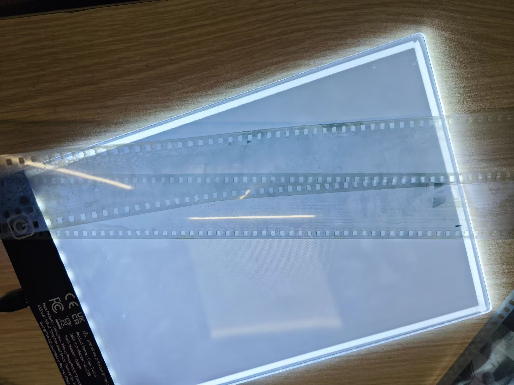
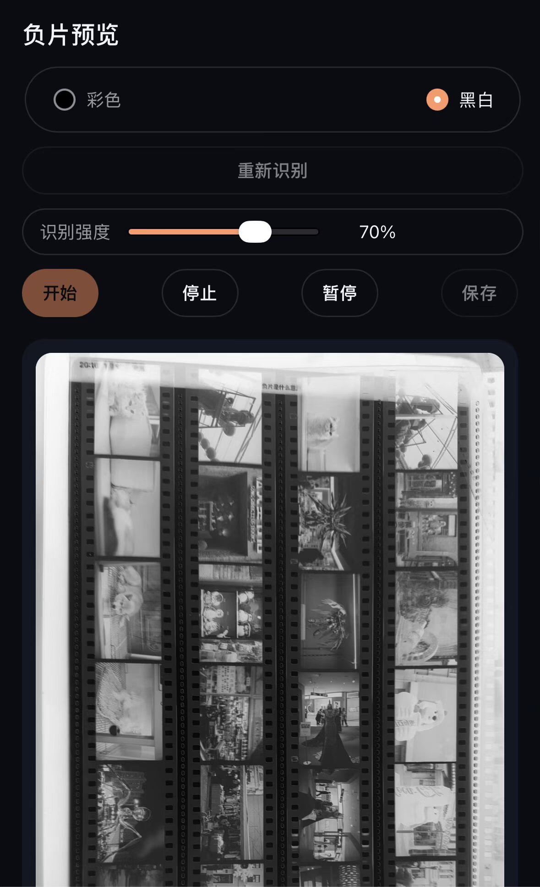
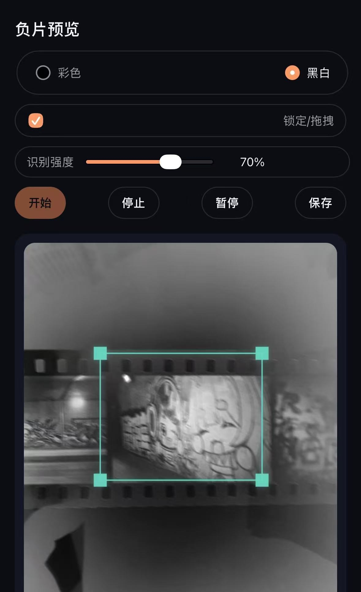

# 胶片摄影日记

近日利用 CodeX 制作了一个简易的胶片预览网站，突然意识到自己懒癌发作已经很久没有写博客了，于是写下此文用来记录两个月来的胶片入门过程和介绍网站的基础使用方法。

## 初入胶片

期末周的日子总是枯燥的，在短视频平台的影响下我接触了胶片摄影，相较于入门费用极高的数码摄影，胶片摄影只需要一百就能过足我的摄影瘾。于是我从闲鱼平台购入了一台美能达zoom 135和一卷shd100pro胶卷(被商家坑了买了卷过期卷)。

因为过期卷和缺少基础知识的双重buff下，第一卷废片很多，只有8张正常成像的照片，其中下面这张是其中曝光最正常的一张。这一张拍摄于校外的小吃摊，是当时复习之后买晚饭的时候拍摄的，本来还拍摄了对面的烤肉摊，但是没有正常对焦。

之后了解到了乐凯胶卷复产，通过航空里程兑换，我在京东买到了乐凯C200胶卷，是我的第一卷彩负。在拍摄这一卷的时候由于已经有了差不多的经验，并且胶卷正常，所以基本都正常成像了。

成片的色彩让我很惊喜，但是部分图片还是存在欠曝等问题，并且傻瓜机无法设置自行设置快门速度和光圈，所以我萌生了更换相机的想法。

## 第一台旁轴机械相机

在闲鱼闲逛的时候看见了一台国产海鸥205相机，符合我对老胶片相机的刻板印象，并且只需要98元就能体验到手动机械胶片相机，于是火速拿下。

到手后我自行更换了蒙皮(帅炸了)，之后购入了3卷乐凯1025过期胶卷。之后找了同校的学长冲洗，学长技术不是很熟练加上1025片基很薄，冲洗过程中胶片粘粘，导致我收获了第一条白海带卷。

拍摄了好几天的照片都没有了，念及同校校友也就没有追究了，不过幸好还留了几张正常成像的照片。

这一张拍摄于学习的冬日美食节，由于手机翻拍的缘故导致画质很差。

## 胶片预览

上面的过程是我初学胶片摄影的简单描述，后续买出了傻瓜机之后又购入了国产的凤凰DC901套机，美能达SRT Super，富士Date以及奥林巴斯Pen EE(未到货)，也许将手头拍完的胶片冲洗之后会再记录一下估光估焦的过程。

下面是我使用 CodeX 制作的胶片预览小程序，制作小程序的初衷很简单，就是为了在胶片冲洗和扫描的中间期过提前看片的瘾，但是市面上的预览软件又十分昂贵(搞不懂一个简单的反转颜色小程序为毛能买68,还有一群人吹)。

下面是软件的界面，主要功能就是调用设备摄像头权限反转颜色实现实时预览，其中开启和暂停就是对于摄像头权限的控制按钮。

点击暂停按钮之后会将当前摄像机的画面拍摄进入一个静态画面，会调用 opencv.js 进行矩形拟合来匹配胶片图片，之后点击保存就可以下载到本地文件中，其中选择框可以手动二次调整，这个过程全程在本地进行处理。图中所示的是前一般页面，由于逻辑不是很完善会导致画面大多数都是糊的，但是这个问题目前已经解决了。(附一张保存的样图使用dc901+1025拍摄)

